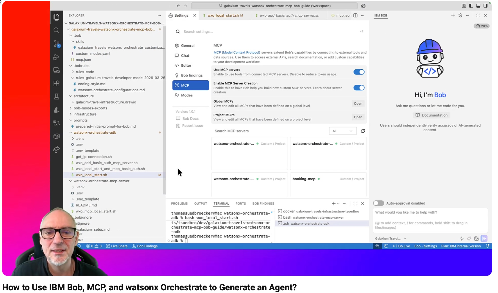

# From Local Infrastructure to AI Booking Agent: Galaxium Travels with watsonx Orchestrate and IBM Bob

This repository is a step-by-step guide for:

- setting up the Galaxium Travels infrastructure
- checking the Basic Auth MCP server by hand
- starting local `watsonx Orchestrate Development Edition`
- adding the Galaxium Travels MCP server to `watsonx Orchestrate`
- configuring IBM Bob for this project
- preparing a Bob prompt for the Galaxium booking agent

## Related YouTube video

`How to Use IBM Bob, MCP, and watsonx Orchestrate to Generate an Agent?`
[](https://youtu.be/QRb2_ZVlynE?si=MG6RmWewAlmGkSjn)

## Related blog post

[Using IBM Bob , MCP, and watsonx Orchestrate to Generate an Agent](https://suedbroecker.net/2026/03/29/using-ibm-bob-mcp-and-watsonx-orchestrate-to-generate-an-agent/)

## Main Objective

The main objective of this repository is to provide a working local environment
where:

- `watsonx Orchestrate Developer Edition` runs locally
- the related `watsonx Orchestrate` MCP server runs locally
- both can be configured manually to integrate with the Galaxium Travels infrastructure in `./infrastructure/`

During the walkthrough, the Galaxium Travels infrastructure is set up with Basic
Auth so the local `watsonx Orchestrate` environment can connect to it.

With this setup in place, you can focus on:

- integration and configuration of `watsonx Orchestrate`
- agent and tool setup
- code changes in the infrastructure when needed

## Why The First Steps Matter

The first part of this repository is about building the working infrastructure.
That means:

- cloning and starting the Galaxium Travels infrastructure
- enabling the Basic Auth configuration
- preparing the local `watsonx Orchestrate Developer Edition` runtime
- preparing the local `watsonx Orchestrate` MCP server

This setup comes first because Bob is most useful only after the local
environment is ready and understood.

## Later Bob Goal

After the infrastructure and local runtime are working, the later goal is to use
Bob to build the Galaxium booking agent.

The prepared Bob prompt is in:

- `prompts/prepared-initial-prompt-for-bob.md`

Its current objective is:

> Build an AI travel booking agent in watsonx Orchestrate Developer Edition using the Galaxium Travels MCP server. Complete all setup and verification steps automatically with minimal user interaction. Switch modes as needed.

The active Bob configuration in this repository is stored in:

- `.bob`
- `.bobignore`
- `.bobrules`
- `AGENTS.md`

The repository also contains Bob support content in:

- `bob-modes-exports/`
- `prompts/`

## Clone This Repository

```sh
git clone https://github.com/thomassuedbroecker/galaxium-travels-watsonx-orchestrate-mcp-bob-guide.git
cd galaxium-travels-watsonx-orchestrate-mcp-bob-guide
```

## Guide Flow

1. [Set Up The Galaxium Travels Infrastructure](./1-galaxium_setup.md)
2. [Manually Verify The Basic Auth MCP Server](./2-galaxium_manual_basic_auth_mcp_verification.md)
3. [Set Up The `watsonx Orchestrate` ADK](./3-watsonx-orchestrate-adk-setup.md)
4. [Add The Basic Auth MCP Server To `watsonx Orchestrate`](./4-watsonx-orchestrate-adk-add-basic-auth-mcp.md)
5. [Configure IBM Bob For This Repository](./9-bob-configuration.md)
6. Use `prompts/prepared-initial-prompt-for-bob.md` to start the Bob-based agent work

## Repository Layout

The current top-level structure is:

```text
├── .bob
├── .bobignore
├── .bobrules
├── 1-galaxium_setup.md
├── 2-galaxium_manual_basic_auth_mcp_verification.md
├── 3-watsonx-orchestrate-adk-setup.md
├── 4-watsonx-orchestrate-adk-add-basic-auth-mcp.md
├── 9-bob-configuration.md
├── AGENTS.md
├── README.md
├── architecture
├── bob-modes-exports
├── images
├── infrastructure
├── prompts
├── watsonx-orchestrate-adk
└── watsonx-orchestrate-mcp-server
```

## Important Folders And Files

- `.bob/` contains the Bob MCP server configuration, custom mode, and project skill.
- `.bobrules/` contains Bob project rules.
- `.bobignore` exists in the repository and is currently empty.
- `AGENTS.md` contains repository-level team standards for agent work.
- `architecture/` contains the editable infrastructure diagram `galaxim-travel-infrastructure.drawio`.
- `bob-modes-exports/` currently contains a placeholder `README.md` for Bob mode exports.
- `images/` currently contains the YouTube preview image `youtube-01.jpg`.
- `infrastructure/` is the folder where you can place the external Galaxium Travels infrastructure repository.
- `prompts/` contains the prepared Bob prompt. The current file is `prepared-initial-prompt-for-bob.md`.
- `watsonx-orchestrate-adk/` contains the local environment template and helper scripts for `watsonx Orchestrate`.
- `watsonx-orchestrate-mcp-server/` contains the local MCP server helper script and a short README.

## How The Parts Fit Together

- The numbered Markdown files are the main guide.
- The `architecture/` folder stores the editable Draw.io source for the infrastructure view.
- The `infrastructure/` folder is used together with the separate Galaxium Travels infrastructure repository.
- The `watsonx-orchestrate-adk/` folder helps you run local `watsonx Orchestrate Developer Edition`.
- The `.bob`, `.bobignore`, `.bobrules`, and `AGENTS.md` files configure how IBM Bob should work in this repository.
- The `prompts/` folder contains prompt text you can use with Bob when building the Galaxium booking agent.

## Recommended Run Order

1. Start your container runtime.
2. Follow [1-galaxium_setup.md](./1-galaxium_setup.md).
3. If you want to test the Basic Auth MCP server directly, follow [2-galaxium_manual_basic_auth_mcp_verification.md](./2-galaxium_manual_basic_auth_mcp_verification.md).
4. Follow [3-watsonx-orchestrate-adk-setup.md](./3-watsonx-orchestrate-adk-setup.md) to start the local `watsonx Orchestrate` environment.
5. Follow [4-watsonx-orchestrate-adk-add-basic-auth-mcp.md](./4-watsonx-orchestrate-adk-add-basic-auth-mcp.md) to import the Basic Auth MCP server.
6. Follow [9-bob-configuration.md](./9-bob-configuration.md) to use the IBM Bob configuration in this repository.
7. Use `prompts/prepared-initial-prompt-for-bob.md` when you want Bob to start building the Galaxium booking agent.

## Open-Source Dependencies

This repository is primarily documentation plus helper shell scripts. It does not
currently declare a root-level `pyproject.toml` or `package.json`.

The local workflow documented in this repository still pins the following
open-source Python packages as of `2026-03-31`.

Current pinned Python version:

- `Python 3.13`

Current pinned main runtime libraries:

| Library | Version used in this repo | License | Where referenced |
| --- | --- | --- | --- |
| `ibm-watsonx-orchestrate` | `2.2.0` | MIT | `3-watsonx-orchestrate-adk-setup.md`, `.bob/mcp.json` |
| `ibm-watsonx-orchestrate-mcp-server` | `2.2.0` | MIT | `3-watsonx-orchestrate-adk-setup.md`, `.bob/mcp.json` |

Current open-source CLI prerequisites and tools referenced by the repository:

| Tool | Version in this repo | Notes |
| --- | --- | --- |
| `git` | not pinned | Used to clone the infrastructure repository |
| `curl` | not pinned | Used for manual verification flows |
| `jq` | not pinned | Used with `curl` during verification |
| `npx` | not pinned | Needed only if you use MCP Inspector |
| `uvx` | not pinned | Used by `.bob/mcp.json` to launch the local ADK-based MCP integration |

This repository also requires IBM service credentials that are not open-source
library dependencies:

- `WO_ENTITLEMENT_KEY`
- `WATSONX_APIKEY`
- `WATSONX_SPACE_ID`

Unlike `chaindocs_MCP_example`, this repository does not currently include an
automated local license-audit script because it documents an integration
workflow rather than shipping one installable application.

## Related Repositories

- Galaxium Travels infrastructure repository:
  <https://github.com/thomassuedbroecker/galaxium-travels-infrastructure-tsuedbro>
- Older integration repository:
  <https://github.com/thomassuedbroecker/galaxium-travels-mcp-compose-watsonx-orchestrate>

## Useful References

- IBM watsonx Orchestrate ADK docs:
  <https://developer.watson-orchestrate.ibm.com/>
- IBM docs for importing remote MCP toolkits:
  <https://developer.watson-orchestrate.ibm.com/tools/toolkits/remote_mcp_toolkits#using-streamable-http>
- MCP transport specification:
  <https://modelcontextprotocol.io/specification/2025-06-18/basic/transports>
