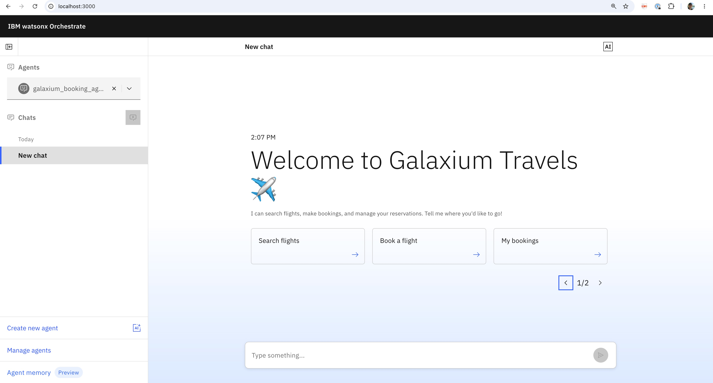
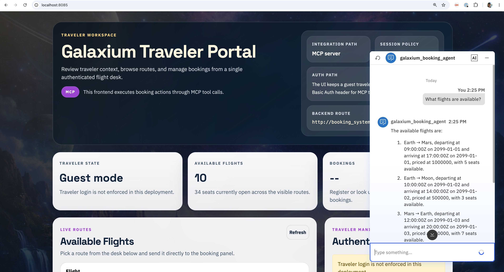
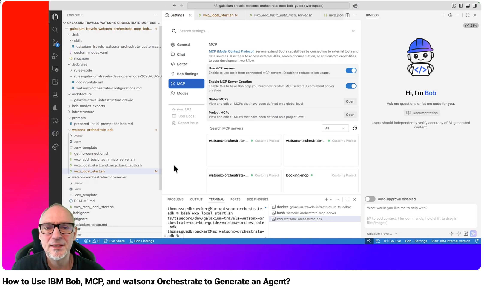
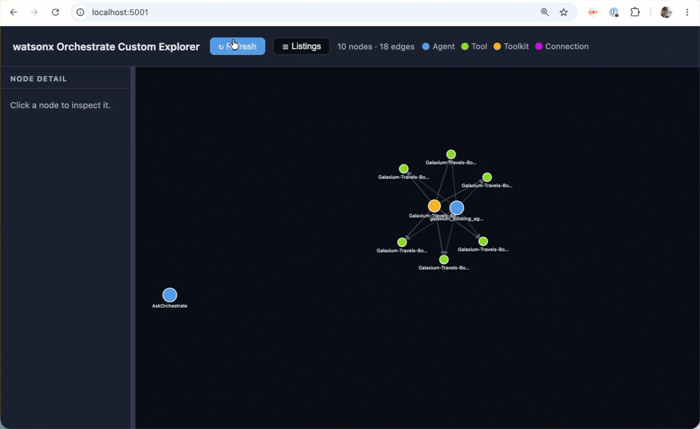

# From Local Infrastructure to AI Booking Agent: Galaxium Travels with watsonx Orchestrate and IBM Bob

This repository is a step-by-step guide for:

- setting up the Galaxium Travels infrastructure
- checking the Basic Auth MCP server by hand
- starting local `watsonx Orchestrate Developer Edition`
- adding the Galaxium Travels MCP server to `watsonx Orchestrate`
- integrating the new agent in watsonx Orchestrate into the Galaxium Travels UI
- configuring IBM Bob for this project
- preparing a Bob prompt for the Galaxium booking agent

Example for the final result:





## Related YouTube video

`How to Use IBM Bob, MCP, and watsonx Orchestrate to Generate an Agent?`
[](https://youtu.be/QRb2_ZVlynE?si=MG6RmWewAlmGkSjn)

## Related blog post

[Using IBM Bob , MCP, and watsonx Orchestrate to Generate an Agent](https://suedbroecker.net/2026/03/29/using-ibm-bob-mcp-and-watsonx-orchestrate-to-generate-an-agent/)

> **Note:** Both the video and the blog post were created with **Bob 1.0** and **watsonx Orchestrate 2.2.0**. The concrete configuration steps shown there (Bob setup, ADK commands, Basic Auth MCP server registration) reflect those older versions and may differ from the current guide. Only the **main concept** — running a local watsonx Orchestrate environment and connecting a **Basic Auth MCP server** via IBM Bob — and the **concrete implementation approach** remain applicable.

## Main Objective

The main objective of this repository is to provide a working local environment
where:

- `watsonx Orchestrate Developer Edition` runs locally
- the related `watsonx Orchestrate` MCP server runs locally
- both can be configured manually to integrate with the Galaxium Travels infrastructure in `./infrastructure/`

During the walkthrough, the Galaxium Travels infrastructure is set up with Basic
Auth so the local `watsonx Orchestrate` environment can connect to it.

With this setup in place, you can focus on:

- integration and configuration of `watsonx Orchestrate`
- agent and tool setup
- code changes in the infrastructure when needed

## The First Steps

The first part of this repository is about building the working infrastructure.

That means:

- cloning and starting the Galaxium Travels infrastructure
- enabling the Basic Auth configuration for the MCP server in the Galaxium Travels example
- preparing the local `watsonx Orchestrate Developer Edition` runtime
- preparing the local `watsonx Orchestrate MCP server`

This setup comes first because Bob is most useful only after the local
environment is ready and understood.

## Goal with IBM Bob

Its current goal is:

> Build an AI travel booking agent in watsonx Orchestrate Developer Edition using the Galaxium Travels MCP server. Complete all setup and verification steps automatically with minimal user interaction. Switch modes as needed.

IBM Bob was also used to generate the **`watsonx_orchestrate_custom_explorer`** application — a dashboard-style single-page app that uses the watsonx Orchestrate MCP server to visualize agent and tool dependencies as an interactive diagram, allowing you to navigate to individual agents and tools directly from the diagram.



The active Bob configuration in this repository is stored in:

- `.bob`
- `.bobignore`
- `.bobrules`
- `AGENTS.md`

The repository also contains Bob support content in:

- `bob-modes-exports/`
- `prompts/`

## Use This Repository As A Template

This repository is a **GitHub template**. To get started, generate your own repository from it:

1. Click the **"Use this template"** button at the top of the repository page on GitHub.
2. Choose a name and visibility for your new repository.
3. Clone your newly generated repository:

```sh
git clone https://github.com/<your-username>/<your-repo-name>.git
cd <your-repo-name>
```

> **Contributing:** Clone this repository directly only if you want to contribute documentation or examples back to the template itself.
>
> ```sh
> git clone https://github.com/thomassuedbroecker/galaxium-travels-watsonx-orchestrate-mcp-bob-guide.git
> cd galaxium-travels-watsonx-orchestrate-mcp-bob-guide
> ```

## Guide Flow

1. [Set Up The Galaxium Travels Infrastructure](./1-galaxium_setup.md)
2. [Manually Verify The Basic Auth MCP Server](./2-galaxium_manual_basic_auth_mcp_verification.md)
3. [Set Up The `watsonx Orchestrate` ADK](./3-watsonx-orchestrate-adk-setup.md)
4. [Add The Basic Auth MCP Server To `watsonx Orchestrate`](./4-watsonx-orchestrate-adk-add-basic-auth-mcp.md)
5. [Inspect The `watsonx Orchestrate` Server Logs](./5-watsonx-server-inspection.md)
6. [Configure IBM Bob For This Repository](./9-bob-configuration.md)
7. [Prompts for using IBM Bob](./10-bob-prompts.md) to start to build a watsonx Orchestrate agent and more, using IBM Bob.
8. [Inspect The watsonx Orchestrate Custom Agent Explorer](./watsonx-orchestrate-mcp-server/watsonx_orchestrate_custom_explorer/README.md) — a Flask + D3.js dashboard generated with IBM Bob that visualizes agent and tool dependencies as an interactive force-directed diagram.

> **File numbering:** the guide files are prefixed `1`–`5`, `9`, `10`. Numbers
> `6`–`8` are intentionally reserved for future guides, so the Bob configuration
> (`9-bob-configuration.md`) and prompts (`10-bob-prompts.md`) guides keep those
> prefixes even though they appear as steps 6 and 7 in the flow above.

## Repository Layout

The current top-level structure is:

```text
├── .bob
│   ├── custom_modes.yaml
│   ├── mcp.json
│   └── skills/
│       ├── watsonx-orchestrate/    ← ADK skill
│       └── wxo-log-inspector/      ← log-inspection skill (SKILL.md)
├── .bobignore
├── .bobrules
├── 1-galaxium_setup.md
├── 2-galaxium_manual_basic_auth_mcp_verification.md
├── 3-watsonx-orchestrate-adk-setup.md
├── 4-watsonx-orchestrate-adk-add-basic-auth-mcp.md
├── 5-watsonx-server-inspection.md
├── 9-bob-configuration.md
├── 10-bob-prompts.md
├── AGENTS.md
├── README.md
├── architecture
├── bob-modes-exports
├── images
├── infrastructure
├── prompts
├── watsonx-orchestrate-adk
│   ├── wxo_server_log_inspector.sh ← parallel log capture (limactl / Lima VM)
│   ├── wxo_server_log_analyze.sh   ← sessions overview + ANALYSIS_REPORT.md
│   ├── wxo_bob_log_inspect.sh      ← primary: analyse + pass to bob run + export BOB_ANALYSIS_REPORT.md
│   └── ...                         ← other helper scripts and .venv
└── watsonx-orchestrate-mcp-server
    └── watsonx_orchestrate_custom_explorer
```

## Important Folders And Files

- `.bob/` contains the Bob MCP server configuration (`mcp.json`), custom mode (`custom_modes.yaml`), and two skills: `watsonx-orchestrate` (ADK reference) and `wxo-log-inspector` (log-inspection pipeline documented in guide `5`).
- `.bobrules/` contains Bob project rules.
- `.bobignore` exists in the repository and is currently empty.
- `AGENTS.md` contains repository-level team standards for agent work.
- `architecture/` contains the editable infrastructure diagram `galaxium-travels-infrastructure.drawio`.
- `bob-modes-exports/` currently contains a placeholder `README.md` for Bob mode exports.
- `images/` contains the YouTube preview image `youtube-01.jpg` and screenshots/GIFs of the running setup, including `watsonx_orchestrate_custom_explorer_01.gif`.
- `infrastructure/` is the folder where you can place the external Galaxium Travels infrastructure repository.
- `prompts/` contains the prepared Bob prompt. The current file is `prepared-initial-prompt-for-bob.md`.
- `watsonx-orchestrate-adk/` contains the local environment template and helper scripts for `watsonx Orchestrate`, including three log-inspection scripts (`wxo_server_log_inspector.sh`, `wxo_server_log_analyze.sh`, `wxo_bob_log_inspect.sh`) that capture container logs from the Lima VM, analyse them, pass a summary to `bob run` for a structured verdict, and export the result as `BOB_ANALYSIS_REPORT.md` in the session directory (see guide `5`).
- `watsonx-orchestrate-mcp-server/` contains the local MCP server helper script and a short README.
- `watsonx-orchestrate-mcp-server/watsonx_orchestrate_custom_explorer/` contains a Flask + D3.js single-page application generated with IBM Bob. It connects to the watsonx Orchestrate MCP server and displays agents, tools, toolkits, and connections as an interactive force-directed diagram. See the [explorer README](./watsonx-orchestrate-mcp-server/watsonx_orchestrate_custom_explorer/README.md) for setup and usage details.

## How The Parts Fit Together

- The numbered Markdown files are the main guide.
- The `architecture/` folder stores the editable Draw.io source for the infrastructure view.
- The `infrastructure/` folder is used together with the separate Galaxium Travels infrastructure repository.
- The `watsonx-orchestrate-adk/` folder helps you run local `watsonx Orchestrate Developer Edition` and contains the log-inspection pipeline (`wxo_server_log_inspector.sh` → `wxo_server_log_analyze.sh` → `wxo_bob_log_inspect.sh`) described in guide `5`. The final step exports Bob's analysis as `BOB_ANALYSIS_REPORT.md` alongside the other session files.
- The `.bob`, `.bobignore`, `.bobrules`, and `AGENTS.md` files configure how IBM Bob should work in this repository.
- The `prompts/` folder contains prompt text you can use with Bob when building the Galaxium booking agent.
- The `watsonx-orchestrate-mcp-server/watsonx_orchestrate_custom_explorer/` application was generated with IBM Bob using the watsonx Orchestrate MCP server. It provides a diagram-based dashboard to explore dependencies between agents and tools and navigate to them directly. See the [explorer README](./watsonx-orchestrate-mcp-server/watsonx_orchestrate_custom_explorer/README.md) for full setup instructions.

## Recommended Run Order

1. Start your container runtime.
2. Follow [1-galaxium_setup.md](./1-galaxium_setup.md).
3. If you want to test the Basic Auth MCP server directly, follow [2-galaxium_manual_basic_auth_mcp_verification.md](./2-galaxium_manual_basic_auth_mcp_verification.md).
4. Follow [3-watsonx-orchestrate-adk-setup.md](./3-watsonx-orchestrate-adk-setup.md) to start the local `watsonx Orchestrate` environment.
5. Follow [4-watsonx-orchestrate-adk-add-basic-auth-mcp.md](./4-watsonx-orchestrate-adk-add-basic-auth-mcp.md) to import the Basic Auth MCP server.
6. Follow [5-watsonx-server-inspection.md](./5-watsonx-server-inspection.md) to capture and analyse server logs during a test run.
7. Follow [9-bob-configuration.md](./9-bob-configuration.md) to use the IBM Bob configuration in this repository.
8. Use [Bob prompts](./10-bob-prompts.md) when you want Bob to start building the Galaxium booking agent.
9. Inspect the [watsonx Orchestrate Custom Agent Explorer](./watsonx-orchestrate-mcp-server/watsonx_orchestrate_custom_explorer/README.md) to visualize your agents, tools, toolkits, and connections as an interactive diagram.

## Open-Source Dependencies

This repository is primarily documentation plus helper shell scripts. It does not
currently declare a root-level `pyproject.toml` or `package.json`.

The local workflow documented in this repository still pins the following
open-source Python packages as of `2026-03-31`.

Current pinned Python version:

- `Python 3.13`

Current pinned main runtime libraries:

| Library | Version used in this repo | License | Where referenced |
| --- | --- | --- | --- |
| `ibm-watsonx-orchestrate` | `2.12.0` | MIT | `3-watsonx-orchestrate-adk-setup.md`, `.bob/mcp.json` |
| `ibm-watsonx-orchestrate-mcp-server` | `2.12.0` | MIT | `3-watsonx-orchestrate-adk-setup.md`, `.bob/mcp.json` |

The `watsonx_orchestrate_custom_explorer/` application (generated with IBM Bob)
adds these open-source libraries:

| Library | Version used in this repo | License | Where referenced |
| --- | --- | --- | --- |
| `flask` | `3.0.0` | BSD-3-Clause | `watsonx_orchestrate_custom_explorer/requirements.txt` |
| `flask-cors` | `4.0.0` | MIT | `watsonx_orchestrate_custom_explorer/requirements.txt` |
| `python-dotenv` | `>=1.1.0` | BSD-3-Clause | `watsonx_orchestrate_custom_explorer/requirements.txt` |
| `mcp` (SDK) | inherited from parent `.venv` | Apache-2.0 | `watsonx_orchestrate_custom_explorer/src/api.py` |
| `D3.js` | `7.9.0` | ISC | `watsonx_orchestrate_custom_explorer/public/index.html` (jsDelivr CDN) |

Current open-source CLI prerequisites and tools referenced by the repository:

| Tool | Version in this repo | Notes |
| --- | --- | --- |
| `git` | not pinned | Used to clone the infrastructure repository |
| `curl` | not pinned | Used for manual verification flows |
| `jq` | not pinned | Used with `curl` during verification |
| `npx` | not pinned | Needed only if you use MCP Inspector |
| `uvx` | not pinned | Used by `.bob/mcp.json` to launch the local ADK-based MCP integration |

This repository also requires IBM service credentials that are not open-source
library dependencies:

- `WO_ENTITLEMENT_KEY`
- `WATSONX_APIKEY`
- `WATSONX_SPACE_ID`

This repository does not currently include an automated local license-audit
script, because it documents an integration workflow rather than shipping a
single installable application.

For the maintained dependency/license mapping, see
[Dependency And License Transparency](DEPENDENCY_LICENSE_TRANSPARENCY.md).

## Related Repositories

- Galaxium Travels infrastructure repository:
  <https://github.com/thomassuedbroecker/galaxium-travels-infrastructure-tsuedbro>
- Older integration repository:
  <https://github.com/thomassuedbroecker/galaxium-travels-mcp-compose-watsonx-orchestrate>

## Useful References

- IBM watsonx Orchestrate ADK docs:
  <https://developer.watson-orchestrate.ibm.com/>
- IBM docs for importing remote MCP toolkits:
  <https://developer.watson-orchestrate.ibm.com/tools/toolkits/remote_mcp_toolkits#using-streamable-http>
- MCP transport specification:
  <https://modelcontextprotocol.io/specification/2025-06-18/basic/transports>
